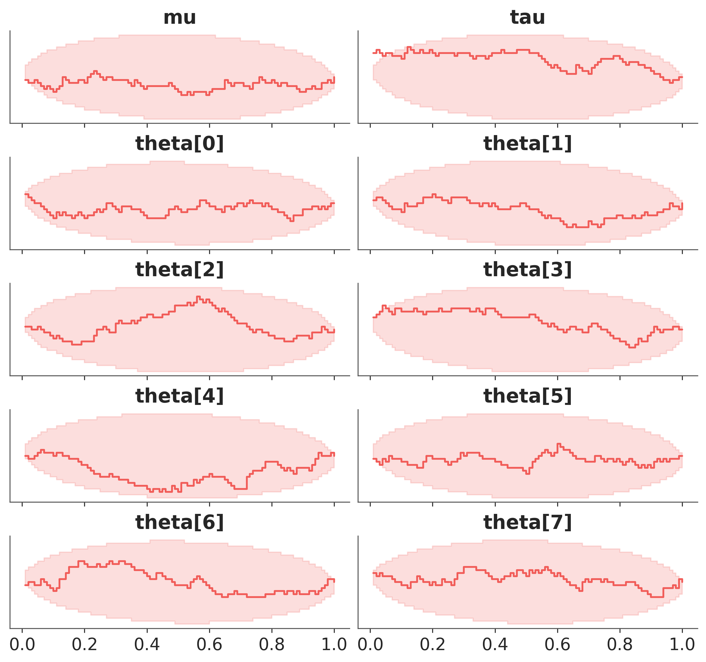

# Simulation Based Calibration

A [PyMC](http://docs.pymc.io) and [Bambi](https://bambinos.github.io/bambi/) implementation of the algorithms from:

Sean Talts, Michael Betancourt, Daniel Simpson, Aki Vehtari, Andrew Gelman: “Validating Bayesian Inference Algorithms with Simulation-Based Calibration”, 2018; [arXiv:1804.06788](http://arxiv.org/abs/1804.06788)

Many thanks to the authors for providing open, reproducible code and implementations in `rstan` and `PyStan` ([link](https://github.com/seantalts/simulation-based-calibration)).


## Installation

May be pip installed from github:

```bash
pip install simuk
```

## Quickstart

1. Define a PyMC or Bambi model. For example, the centered eight schools model:

    ```python
    import numpy as np
    import pymc as pm

    data = np.array([28.0, 8.0, -3.0, 7.0, -1.0, 1.0, 18.0, 12.0])
    sigma = np.array([15.0, 10.0, 16.0, 11.0, 9.0, 11.0, 10.0, 18.0])

    with pm.Model() as centered_eight:
        mu = pm.Normal('mu', mu=0, sigma=5)
        tau = pm.HalfCauchy('tau', beta=5)
        theta = pm.Normal('theta', mu=mu, sigma=tau, shape=8)
        y_obs = pm.Normal('y', mu=theta, sigma=sigma, observed=data)
    ```
2. Pass the model to the `SBC` class, and run the simulations. This will take a while, as it is running the model many times.
    ```python
    sbc = SBC(centered_eight,
            num_simulations=100, # ideally this should be higher, like 1000
            sample_kwargs={'draws': 25, 'tune': 50})

    sbc.run_simulations()
    ```
    ```python
    79%|███████▉  | 79/100 [05:36<01:29,  4.27s/it]
    ```

3. Plot the empirical CDF for the difference between prior and posterior. The lines
should be close to uniform and within the oval envelope.

    ```python
    sbc.plot_results()
    ```




## What is going on here?

The [paper on the arXiv](http://arxiv.org/abs/1804.06788) is very well written, and explains the algorithm quite well.

Morally, the example below is exactly what this library does, but it generalizes to more complicated models:

```python
with pm.Model() as model:
    x = pm.Normal('x')
    pm.Normal('y', mu=x, observed=y)
```

Then what this library does is compute

```python
with my_model():
    prior_samples = pm.sample_prior_predictive(num_trials)

simulations = {'x': []}
for idx in range(num_trials):
    y_tilde = prior_samples['y'][idx]
    x_tilde = prior_samples['x'][idx]
    with model(y=y_tilde):
        idata = pm.sample()
    simulations['x'].append((idata.posterior['x'] < x_tilde).sum())
```
