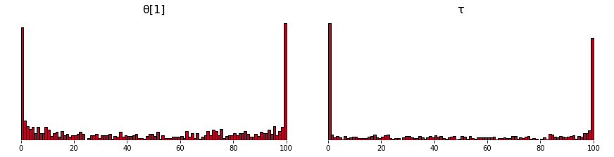
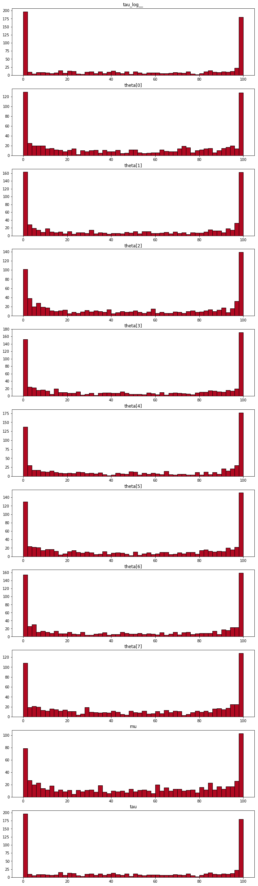

# Simulation Based Calibration

A [PyMC](http://docs.pymc.io) and [Bambi](https://bambinos.github.io/bambi/) implementation of the algorithms from:

Sean Talts, Michael Betancourt, Daniel Simpson, Aki Vehtari, Andrew Gelman: “Validating Bayesian Inference Algorithms with Simulation-Based Calibration”, 2018; [arXiv:1804.06788](http://arxiv.org/abs/1804.06788)

Many thanks to the authors for providing open, reproducible code and implementations in `rstan` and `PyStan` ([link](https://github.com/seantalts/simulation-based-calibration)).


## Installation

May be pip installed from github:

```bash
pip install git+https://github.com/ColCarroll/simulation_based_calibration
```

## Quickstart

1. Define a function returning a PyMC3 model. The arguments must be the same as the observed variables.

    ```python
    import numpy as np
    import pymc3 as pm

    def centered_eight_model(y=None):
        J = 8
        sigma = np.array([15., 10., 16., 11.,  9., 11., 10., 18.])

        with pm.Model() as centered_eight:
            mu = pm.Normal('mu', mu=0, sd=5)
            tau = pm.HalfCauchy('tau', beta=5)
            theta = pm.Normal('theta', mu=mu, sd=tau, shape=J)
            y_obs = pm.Normal('y', mu=theta, sd=sigma, observed=y, shape=J)
        return centered_eight
    ```
2. Run simulations
    ```python
    sbc = SBC(centered_eight_model, 'y',
            num_simulations=1000,
            sample_kwargs={'draws': 25, 'tune': 50})

    sbc.run_simulations()
    ```
    ```pythontb
    76%|███████▌  | 758/1000 [1:57:28<37:35,  9.32s/it, WarningType.BAD_ACCEPTANCE=837, WarningType.DIVERGENCES=300, WarningType.TREEDEPTH=3]
    ```

3. Plot the resulting rank statistics.
    ```python
    sbc.plot_sbc()
    ```
    (the plot is at the bottom of the README because it is large).

## What is going on here?

The [paper on the ArxiV](http://arxiv.org/abs/1804.06788) is very well written, and explains the algorithm quite well.

Morally, the example below is exactly what this library does, but it generalizes to more complicated models:

```python
def my_model(y=None):
    with pm.Model() as model:
        x = pm.Normal('x')
        pm.Normal('y', mu=x, observed=y)
    return model
```

Then what this library does is compute

```python
with my_model():
    prior_samples = pm.sample_prior_predictive(num_trials)

simulations = {'x': []}
for idx in range(num_trials):
    y_tilde = prior_samples['y'][idx]
    x_tilde = prior_samples['x'][idx]
    with model(y=y_tilde):
        trace = pm.sample()
    simulations['x'].append((trace['x'] < x_tilde).sum())
```

## Features, warnings, and details

- **You can start and stop the simulations** This is pretty robust, and works the way you would expect even if you have set a random seed. This is useful if you want to peek at the histogram early.
- **No observations!** Simulation based calibration is a way to calibrate your observations independent of observed data, and the observations are not needed or used by this library.
- **Pass `shape` to your observed variables** When defining your PyMC3 model, the shape of observed variables is usually inferred from the observations. We can not do that here (see **No observations** above), so need a hint.
- **The progressbar is extra informative** Notice that it collects all the warnings from each PyMC3 sampling run and aggregates it for you. If you are getting tons of divergences, maybe you do not need simulation based calibration to know your model has some problems?
- **This takes a long time** It is embarrassingly parallel, but this implementation will not help you with that.
- **Other rank statistics** You can add a `pm.Deterministic` variable to your model to compute other rank statistics.

## Examples from the paper

**Fig. 10**: This plot of θ has way less mass in the middle than the plot from the paper. I suspect it has to do with how little tuning and warmup I am doing.



## TODO

- Add thinning
- Add ADVI option
- Run on all examples from paper


